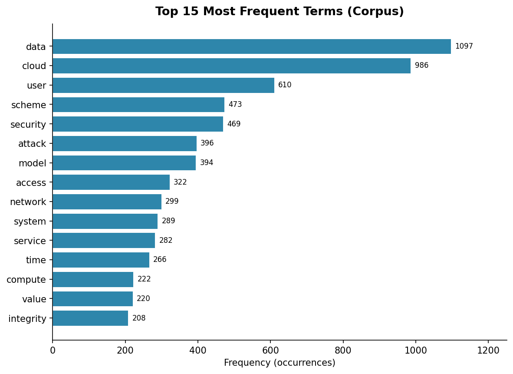
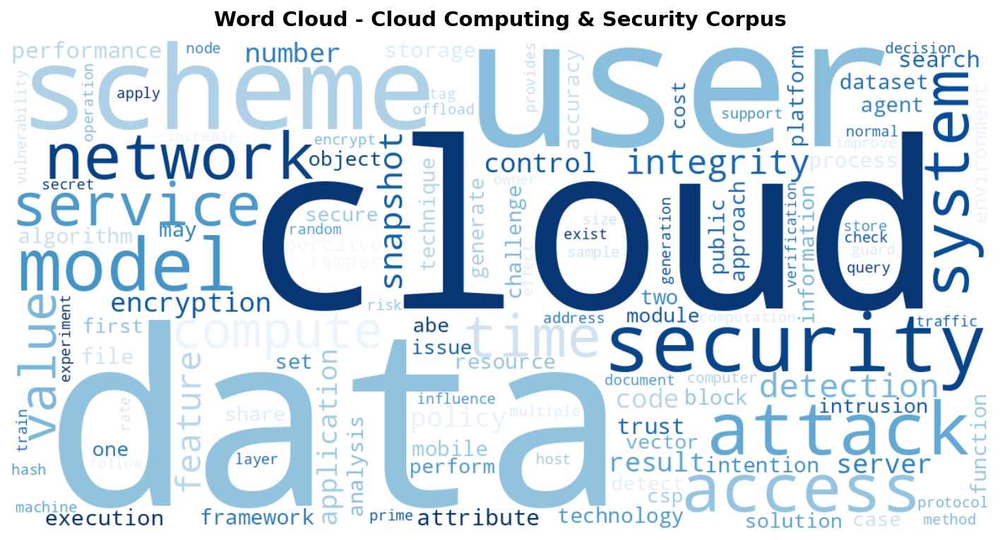
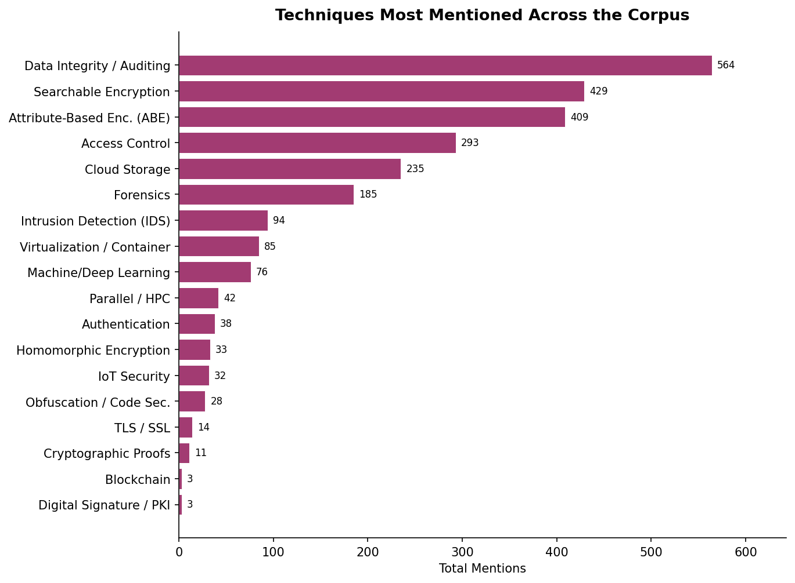
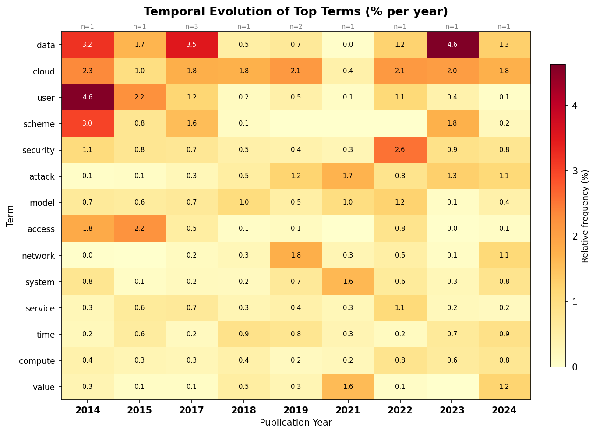
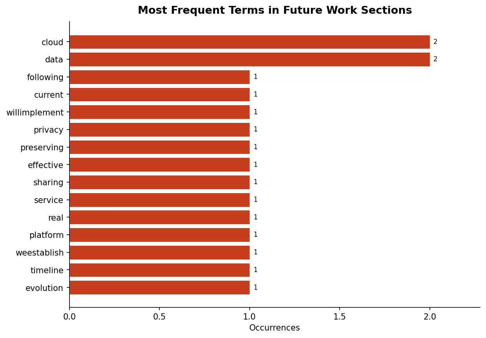
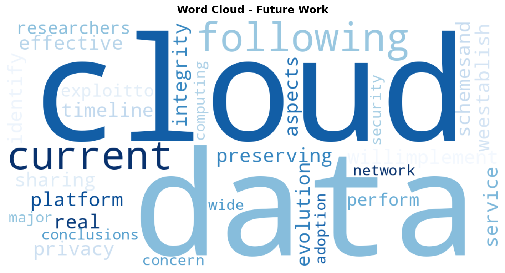

<!--
Estes slides seguem a estrutura exigida pelo enunciado (Etapa 5) e incorporam
a Etapa 4 (avaliação de desempenho) dentro do item 7.
Marcadores 🔧 TODO indicam informação que o(a) autor(a) do trabalho precisa
preencher manualmente — não temos esse dado disponível.
Se a ferramenta de slides usada no VS Code não for o Marp, basta remover o
bloco de front-matter acima (entre as duas primeiras linhas "---"); a
separação dos slides pelas linhas "---" continua funcionando normalmente.
-->

# Ontologia de Artigos Científicos
## Computação na Nuvem & Segurança

Universidade Estadual de Maringá — Departamento de Informática
Curso: Ciência da Computação
Disciplina: IIA - Introdução à Inteligência Artificial
Professor: Prof. Dr. Wagner Igarashi
Equipe: Caetano (RA: 135846), Lorenzo (RA 133076), Vitor da Rocha (RA 132769)

---

## Sumário

1. Introdução
2. Fundamentação teórica
3. Materiais e métodos
4. Fonte dos dados
5. Visualizações do córpus
6. Demonstração em artigos adicionais
7. Avaliação de desempenho do sistema
8. Conclusões
9. Bibliografia

---

# 1. Introdução

---

## O problema

- O volume de artigos científicos publicados cresce mais rápido do que a
  capacidade humana de lê-los e organizá-los manualmente.
- Ler, classificar e resumir manualmente um córpus de artigos é um processo
  lento e repetitivo.
- **Pergunta do trabalho:** é possível usar técnicas de PLN (sem modelos de
  aprendizado de máquina/pré-treinados) para extrair automaticamente a
  estrutura e o conteúdo essencial de um artigo científico?

---

## Modelagem do problema

Modelamos o artigo científico como uma **ontologia** com os seguintes
elementos, a serem extraídos automaticamente do PDF:

- Identificação: título, autores, ano, DOI, periódico
- Conteúdo: abstract, palavras-chave, introdução, corpo, conclusão
- Análise: objetivo, problema, metodologia, contribuições, trabalhos futuros
- Referências bibliográficas citadas

O software desenvolvido lê um diretório de PDFs e produz, para cada artigo,
uma instância estruturada dessa ontologia.

---

# 2. Fundamentação teórica

---

## Modelos de linguagem e pré-processamento

- **Tokenização**: quebra do texto em unidades (palavras/termos)
- **Stop-words**: remoção de palavras de alta frequência e baixo valor
  semântico (artigos, preposições, conectivos)
- **Lematização** (WordNet): reduz a palavra à sua forma canônica de
  dicionário (ex.: *"schemes" → "scheme"*)
- **Stemming** (Porter/Snowball): reduz a palavra ao seu radical, de forma
  mais agressiva que a lematização (disponível no código, desligado por
  padrão)
- **Bag-of-Words**: representa o texto pela contagem de frequência de cada
  termo, ignorando a ordem das palavras
- **N-gramas**: sequências de N termos consecutivos (bigramas, trigramas),
  úteis para capturar termos técnicos compostos (ex.: *"cloud computing"*)

---

## Extração de informação e ontologias

- **Extração de informação baseada em regras (rule-based IE)**: uso de
  expressões regulares e padrões linguísticos para localizar frases que
  expressam objetivo, problema, metodologia e contribuições.
- **Ontologias e Web Semântica**: estrutura formal de conceitos e relações de
  um domínio. Dentre os formatos possíveis (RDF/XML, Turtle, OWL, Frames,
  JSON-LD), o trabalho usa **JSON-LD**, que combina legibilidade com
  compatibilidade direta com APIs e o vocabulário padronizado do
  [schema.org](https://schema.org)

---

# 3. Materiais e métodos

---

## Linguagem e bibliotecas

| Biblioteca | Uso no projeto |
|---|---|
| Python 3 (stdlib) | Lógica geral do pipeline |
| `PyPDF2` | Extração de texto dos PDFs |
| `nltk` | Stop-words, lematização (WordNet), stemming |
| `matplotlib` + `numpy` | Gráficos e heatmaps |
| `wordcloud` | Nuvens de palavras |

Nenhuma biblioteca de aprendizado de máquina ou modelo pré-treinado foi
utilizada, em conformidade com a restrição do enunciado.

---

## Pipeline do sistema

```
PDFs (12 artigos)
   │
   ▼
1. Leitura (PyPDF2) ──► 2. Limpeza de artefatos de PDF
   │
   ▼
3. Categorização (regex) ──► título, autores, seções, referências
   │
   ▼
4. Pré-processamento ──► stop-words, lematização
   │
   ▼
5. Modelos de linguagem ──► bag-of-words, n-gramas, top termos
   │
   ▼
6. Extração de informação ──► objetivo, problema, metodologia, contribuições
   │
   ▼
7. Exportação da ontologia (JSON-LD) + Visualizações
```

---

# 4. Fonte dos dados

---

## Córpus analisado

- **Tema:** Computação na Nuvem
- **Base:** ScienceDirect
- **Periódico de origem dos 12 artigos:** *Computers & Security* (Elsevier)
- **Período de publicação:** 2014 – 2024
- **Assuntos recorrentes:** auditoria e integridade de dados na nuvem,
  criptografia baseada em atributos, detecção de intrusão em redes virtuais,
  forense digital, segurança em IoT, computação móvel-nuvem

🔧 **TODO:** informar o termo de busca exato utilizado no ScienceDirect e os
critérios de seleção dos 12 artigos (ex.: filtros de data, citações, etc.).

---

## Os 12 artigos do córpus

| Título (resumido) | Ano | Refs. |
|---|---|---|
| SNAPS: snapshot based provenance system for VMs in the cloud | 2019 | 11 |
| Security analysis of a public auditing scheme for secure data storage | 2023 | 17 |
| Efficient security framework for detecting intrusions in virtual networks | 2019 | 35 |
| Trust or consequences? Causal effects of perceived risk... | 2017 | 55 |
| Self-Attention conditional GAN for... | 2024 | 34 |
| A survey of cloud computing data integrity schemes | 2017 | 100 |

---

## Os 12 artigos do córpus (continuação)

| Título (resumido) | Ano | Refs. |
|---|---|---|
| Sticky policies approach within cloud computing | 2017 | 45 |
| Optimized extreme learning machine for detecting DDoS attacks | 2021 | 32 |
| Cloud computing security: a survey of service-based models | 2022 | 59 |
| Parallel search over encrypted data under attribute-based encryption | 2015 | 24 |
| Achieving an effective, scalable and privacy-preserving data... | 2014 | 30 |
| A self-protecting agents based model for high-performance mobile-cloud | 2018 | 34 |

**Total: 12 artigos, 476 referências bibliográficas extraídas no total.**

---

# 5. Visualizações do córpus

---

## Palavras mais citadas nos artigos



Termos mais frequentes do córpus (unitermos, excluindo as referências):
**data** (1192), **cloud** (1035), **security** (439), **user** (354),
**access** (341), **model** (331), **scheme** (330)...

Bigrama mais citado: **"data integrity"** (157) e **"cloud computing"** (149).

---

## Nuvem de palavras geral



A nuvem reforça visualmente o predomínio dos termos relacionados a
armazenamento e proteção de dados em nuvem.

---

## Técnicas mais mencionadas nos artigos



Reflete o foco do córpus em **integridade e confidencialidade de dados
armazenados na nuvem**.

---

## Evolução temporal dos termos



- O heatmap mostra a frequência relativa (%) dos termos mais citados, ano a
  ano, permitindo observar a permanência de termos como *data* e *cloud*
  ao longo de toda a década analisada. Outros termos mais recentes como IoT acabam sendo mais comuns.

---

## Termos em trabalhos futuros



- A seção de trabalhos futuros foi identificada explicitamente em apenas
  **3 dos 12 artigos (25%)** — muitos artigos do córpus não têm uma
  subseção de "future work" claramente demarcada na conclusão

---

## Termos em trabalhos futuros



---

## Visualizações complementares

Além do que foi pedido no enunciado, o sistema também gera:

- **Heatmap de coocorrência**: quais termos aparecem próximos uns dos outros no texto
- **Similaridade entre artigos**: similaridade de Jaccard entre os conjuntos de termos de cada artigo, em heatmap e em diagrama de rede
- **Árvore de palavras**: contexto (palavras antes/depois) do termo "cloud" no córpus
---
## Visualizações complementares
- **Heatmap de coocorrência**

---
## Visualizações complementares
- **Similaridade entre artigos**

---
## Visualizações complementares
- **Similaridade entre artigos**

---
## Visualizações complementares
- **Árvore de palavras**

---

# 6. Demonstração prática em artigos adicionais

---

## 🔧 TODO — pendente de execução

Esta etapa exige rodar o pipeline em **artigos diferentes dos 12 originais**,
para demonstrar que o sistema generaliza.

**Passo a passo sugerido:**

1. Baixar 1–2 artigos novos (mesmo tema, ScienceDirect) e colocá-los em uma
   pasta separada, ex.: `data/ArtigosExtras/`
2. Criar uma pequena cópia do `main.py` apontando `PAPERS_PATH` para essa
   pasta, ou executar o pipeline manualmente em um script/notebook
3. Trazer para este slide:
   - Trechos de objetivo/problema/metodologia/contribuições extraídos
   - Se a extração ficou coerente com o conteúdo real do artigo
   - Algum caso interessante de acerto ou erro

🔧 **TODO:** preencher com os resultados reais depois de executar o passo a
passo acima.

---

# 7. Avaliação de desempenho do sistema

---

## Metodologia de avaliação

Como o trabalho não permite o uso de modelos de ML, não há um gabarito
estatístico (ex.: acurácia de um classificador). A avaliação foi
feita em duas frentes:

1. **Quantitativa** — taxa de cobertura: em quantos artigos cada campo da
   ontologia foi efetivamente extraído (não vazio), calculada diretamente
   sobre as saídas reais do sistema (`categorized_output.json` e
   `extraction_output.json`) para os 12 artigos do córpus
2. **Qualitativa** — leitura manual de uma amostra das frases extraídas,
   comparando-as com o conteúdo real do artigo, para identificar acertos e
   limitações dos padrões de regex utilizados

---

## Resultado quantitativo — Etapa 1 (categorização)

| Campo | Cobertura |
|---|---|
| Título | 100% (12/12) |
| Autores | 100% (12/12) — média de 3,9 autores/artigo |
| Abstract | 100% (12/12) — média de 1.367 caracteres |
| Palavras-chave | 100% (12/12) — média de 5,4 termos/artigo |
| Ano de publicação | 100% (12/12) |
| DOI | 83% (10/12) |
| Referências bibliográficas | 100% (12/12) — 476 no total, média 39,7/artigo |


---

## Resultado quantitativo — Etapa 1 (categorização)

A categorização estrutural (campos bibliográficos) teve **desempenho muito
alto**, pois esses campos seguem um padrão visual/textual bastante regular
nos artigos da Elsevier/ScienceDirect.

---

## Resultado quantitativo — Etapa 2 (extração de informação)

| Campo | Cobertura | Méd. frases/artigo |
|---|---|---|
| Objetivo | 92% (11/12) | 1,2 |
| Problema | 100% (12/12) | 2,2 |
| Metodologia | 100% (12/12) | 3,0 |
| Contribuições | 58% (7/12) | 0,8 |
| Trabalhos futuros | 25% (3/12) | 0,2 |

**Apenas 2 dos 12 artigos (17%) tiveram os 5 campos extraídos
simultaneamente.**

---

## Exemplos de acerto

> **Objetivo** *(intrusion detection em redes virtuais)*:
> "In this paper, we propose a hypervisor level distributed network
> security (HLDNS) framework which is deployed on each processing server
> of cloud computing."

> **Trabalhos futuros** *(mesmo artigo)*:
> "Conclusions and future work — Network security is a major concern for
> wide adoption of the cloud computing."

Esses padrões ("in this paper, we propose...", "future work") são bastante
**convencionais na escrita acadêmica em inglês**, por isso o sistema os
reconhece com boa precisão.

---

## Exemplos de limitação

> **Problema** identificado *(artigo sobre auditoria de dados)*:
> "...to handle the problem of user revocation..., Wang et al. (2015)
> proposed a novel scheme, named Panda."

Esta frase descreve o problema resolvido por um **trabalho relacionado**
(Wang et al., 2015), não necessariamente o problema do próprio artigo —
um falso positivo típico de uma extração baseada apenas em palavras-chave
("problem"), sem compreensão de quem é o sujeito da frase.

- **Contribuições** (58% de cobertura) e **trabalhos futuros** (25%) tiveram
  desempenho mais baixo: a frase exata "contributes to" é rara, e nem todos
  os artigos têm uma subseção de "future work" explícita.

---

## Discussão dos resultados

- O sistema tem **alto desempenho em campos estruturais e bem padronizados**
  (título, autores, abstract, keywords, referências) — domínio onde regex
  sobre o layout do PDF funciona muito bem.
- O sistema tem **desempenho variável em campos semânticos livres**
  (objetivo, problema, metodologia, contribuições, trabalhos futuros) —
  domínio onde a linguagem natural tem muito mais variação, e uma
  abordagem por regras não consegue cobrir todos os estilos de escrita.
- Os padrões "amplos" (fallback) implementados em `extraction.py` aumentam a
  cobertura de Objetivo e Contribuições, mas podem reduzir a precisão em
  alguns casos (como no exemplo de falso positivo acima).

---

# 8. Conclusões

---

## Conclusões

- Foi possível modelar e implementar uma ontologia de artigo científico e um
  pipeline completo de PLN **sem o uso de modelos de aprendizado de
  máquina**, usando apenas pré-processamento clássico, modelos de linguagem
  estatísticos (BoW/n-gramas) e extração de informação baseada em regras.
- O sistema é **muito confiável para metadados estruturais** (título,
  autores, abstract, referências) e **parcialmente confiável para conteúdo
  semântico livre** (objetivo, problema, metodologia, contribuições,
  trabalhos futuros), com cobertura entre 25% e 100% dependendo do campo.
- A ontologia em **JSON-LD** se mostrou um formato prático para representar
  os artigos de forma legível e interoperável com vocabulários da Web
  Semântica (`schema.org`).
- Limitações claras: dependência do layout do periódico de origem, e
  sensibilidade dos padrões de regex a formas alternativas de expressar a
  mesma ideia.


---

# 9. Bibliografia

---

## Bibliografia

🔧 **TODO:** revisar/completar com as fontes que a equipe efetivamente
consultou (sites, vídeos, livros, slides de aula etc.). Sugestões de fontes
técnicas usadas no desenvolvimento:

- PyPDF2 — documentação oficial: https://pypdf2.readthedocs.io/
- NLTK — documentação oficial: https://www.nltk.org/
- Matplotlib — documentação oficial: https://matplotlib.org/
- WordCloud (Python) — https://github.com/amueller/word_cloud
- JSON-LD — especificação W3C: https://www.w3.org/TR/json-ld/
- Schema.org — vocabulário para dados estruturados: https://schema.org/
- Enunciado do trabalho — UEM, Departamento de Informática

---

# Obrigado!
